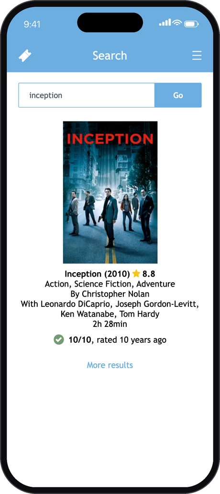
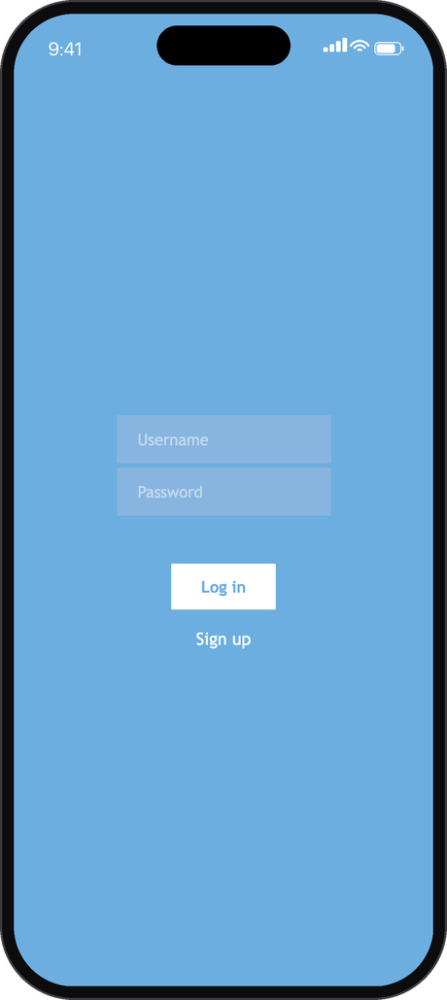
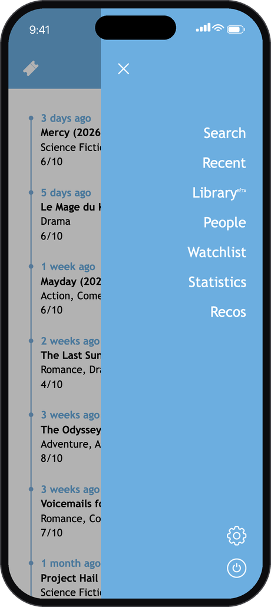
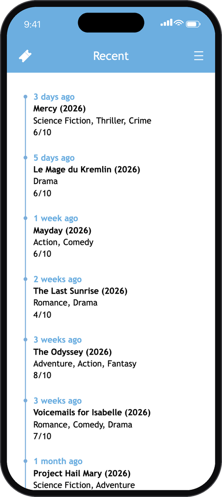
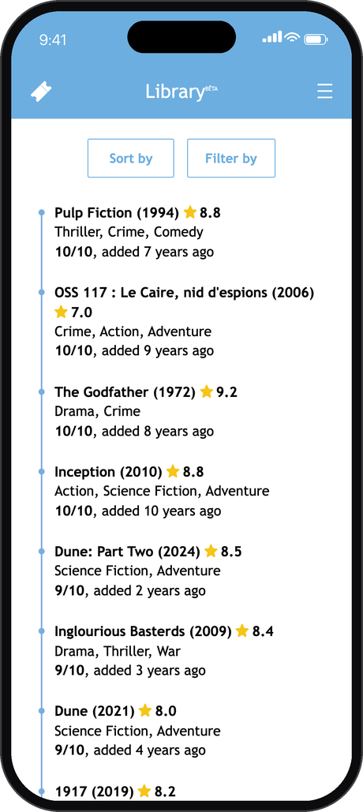
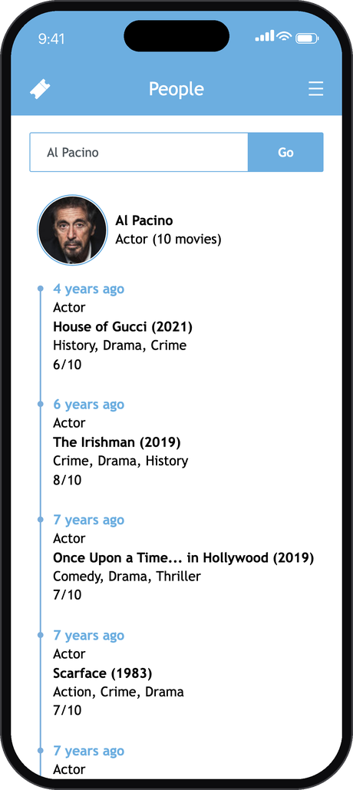
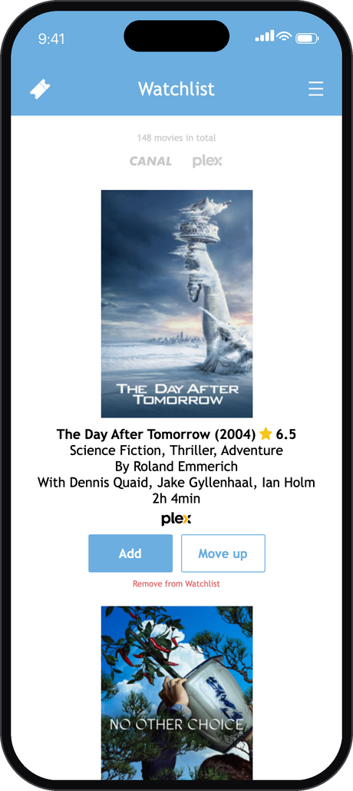
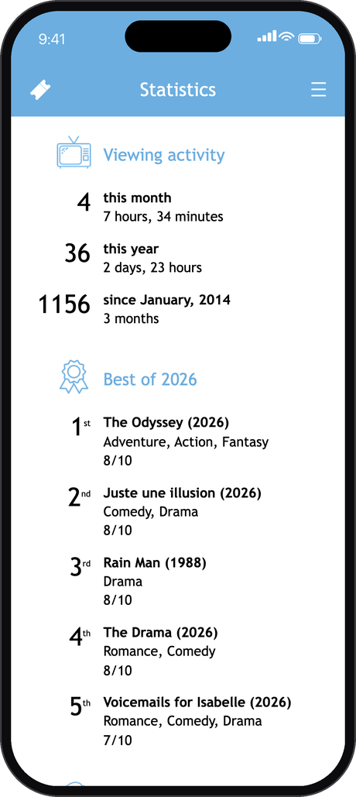
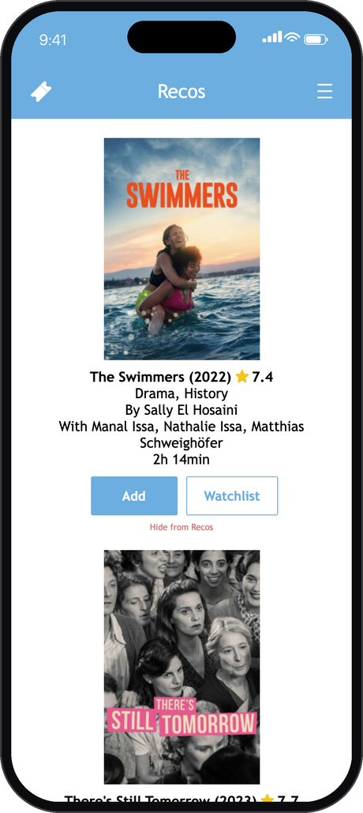
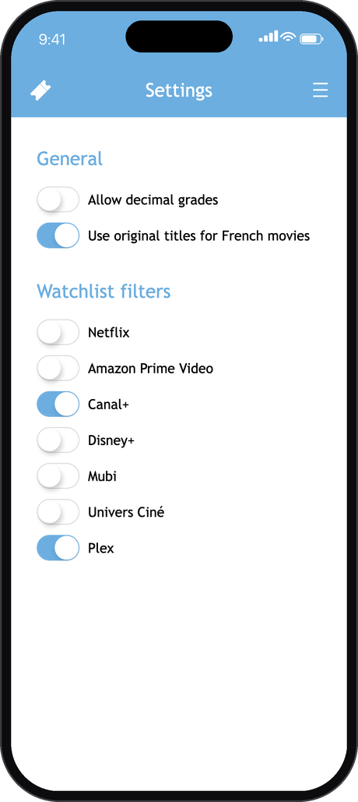

# Movie Journal

_Since January 2014, I have been keeping a log of every movie I watch, in order to remember
what I have seen and to compute a few statistics about it. It started as an Excel file. It is
now a Postgres database and a web app I can reach from my phone._

The database holds both my own viewing records and a copy of the
[open IMDb datasets](https://www.imdb.com/interfaces/), which makes it possible to slice the
data in all sorts of ways: how much I watch, which directors I rate highest, which decades I
keep coming back to. The web app, powered by [TMDb](https://www.themoviedb.org), is how I
search for a movie, rate it and keep track of what I still want to see — from anywhere,
without writing a single SQL query.

<div align="center"></div>

## Features

- **A journal.** Search a movie, rate it from 1 to 10, and it is logged with the date.
- **Multi-user.** Everyone gets their own records, watchlist, statistics and preferences.
- **A watchlist**, showing where each movie can be streamed, filterable by service.
- **Statistics**: viewing activity, best and worst of the year, favourite directors, actors,
  actresses and genres, grade and decade distributions.
- **Recommendations**, based on what other users of the app rated highly.
- **A people view**: every movie you rated for a given actor, director or composer.
- **Preferences**: decimal grades, original titles for French movies, streaming services.
- **Installable.** It is a PWA: added to the home screen, it runs full-screen with its own
  icon and splash screen, and behaves like a native app.

## The web app

The app is mobile-first — it is meant to be used from a phone, one hand, in the dark, right
after the credits roll.

### Login

The landing page. "Remember me" is always on, for 90 days. New users can register from the
"Sign up" link below the form.

<div align="center"></div>

### Search

The home page of the app. Type a title, and each result shows its poster, genres, director,
main cast, runtime and IMDb rating — along with the grade you gave it, if you already have.
From there a movie can be graded (which logs it in the journal) or pushed to the watchlist.

<div align="center"></div>

The icon at the top left always brings you back to an empty search page; the one at the top
right opens the menu, which is how you reach every other page.

<div align="center"></div>

### Recent

The last movies you watched, as a timeline.

<div align="center"></div>

### Library

Everything you ever logged, sortable by grade, IMDb rating or date added, and filterable by
grade range.

<div align="center"></div>

### People

Search for an actor, director or composer and get every movie of theirs you rated, with the
grade you gave it.

<div align="center"></div>

### Watchlist

The movies you still want to see, most recently added first. Each one shows the services it
is currently streaming on, and the list can be filtered down to the services you subscribe
to. Grading a movie from here removes it from the watchlist automatically.

<div align="center"></div>

### Statistics

How much you watched this month, this year and since the beginning, your best and worst
movies of the year, and the directors, actors, actresses and genres you rate highest — the
last one being genuinely useful, since it surfaces people you like without knowing it.

<div align="center"></div>

### Recos

Movies you have not seen, rated highly by other users of the app. Anything that does not
appeal can be hidden for good.

<div align="center"></div>

### Settings

Decimal grades, original titles for French movies, and the streaming services used to filter
the watchlist.

<div align="center"></div>

## Architecture

```
app/       the Flask web app: routes, models, Jinja templates, CSS and JS
lib/       everything that is not the web app: TMDb client, IMDb ETL, helpers
config/    YAML configuration
ddl/       the database schema, applied by hand
```

The app is a plain Flask application — no front-end framework, no build step — served in
production by gunicorn, with Postgres as the only datastore.

Two schemas live in that database:

- **`imdb`** — a copy of the open IMDb datasets (titles, ratings, persons, crew, principals),
  truncated and reloaded by the ETL. Only the ratings are read by the app.
- **`journal`** — the actual data: `users`, `titles`, `persons`, `credits`, `records`,
  `watchlist`, `blacklist`, plus the materialized views behind the Statistics page. Those
  views are refreshed in the background whenever a record is added, updated or deleted.

Movie metadata (posters, cast, runtime, genres) comes from TMDb at request time and is
cached in `journal.titles` as movies get logged; IMDb ratings are joined in from the
bulk-loaded dataset.

There is no migration tool: the schema lives in `ddl/` and changes are applied by hand.

## The IMDb ETL

`run_imdb_etl.py` loads the open IMDb datasets into the `imdb` schema:

```bash
python run_imdb_etl.py -t titles      # one dataset
python run_imdb_etl.py -a             # all of them
python run_imdb_etl.py -a --use-cache # reuse the files already downloaded
```

Each run downloads the GZIP dataset, streams it row by row — filtering, renaming columns and
dropping incomplete rows on the way — then truncates the target table and re-inserts
everything in batches. It is written to run on a small machine, so the file is never loaded
into memory as a whole. Which datasets exist, where they are downloaded from and how their
columns map to the database is all declared in `config/etl.yaml`.

A push notification is sent if a run fails.

## Getting started

Requires Python 3.12 and a Postgres instance.

```bash
pip install -r requirements.txt
psql -d <database> -f ddl/tables/imdb.sql
psql -d <database> -f ddl/tables/journal.sql
psql -d <database> -f ddl/materialized_views/persons.sql
psql -d <database> -f ddl/materialized_views/genres.sql
psql -d <database> -f ddl/materialized_views/tops.sql
```

Then create `config/credentials.yaml`, which is not versioned:

```yaml
db:
  type: postgresql+psycopg2
  host: localhost
  port: 5432
  db: <database>
  user: <user>
  password: <password>
  schema: journal

tmdb:
  api_key: <your TMDb API key>

push:
  user_key: <push notification user key>
  api_token: <push notification api token>
```

...along with `config/app.py`, which is not versioned either, and holds the Flask
configuration:

```python
from lib.tools import read_config, get_db_uri

credentials = read_config('config/credentials.yaml')


class Config(object):
    CSRF_ENABLED = True
    SECRET_KEY = '<a random secret>'
    SQLALCHEMY_DATABASE_URI = get_db_uri(**credentials['db'])
```

Load the IMDb data (`python run_imdb_etl.py -a`), then run the app:

```bash
python run_journal.py
```

It will be served on `http://localhost:8088`. All scripts expect to be run from the root of
the repository.

## Operations

The app is meant to live on a small always-on Linux machine. The examples below are just
that — examples — but they reflect how it is actually run.

Served by gunicorn behind a reverse proxy:

```bash
gunicorn --workers 3 --bind 127.0.0.1:8000 'app:app'
```

kept alive by supervisor:

```ini
[program:journal]
command=/srv/journal/venv/bin/gunicorn --workers 3 --bind 127.0.0.1:8000 'app:app'
directory=/srv/journal
user=journal
autostart=true
autorestart=true
```

and updated with `deploy.sh`, which stops the service, pulls the latest `master` and starts
it back up.

Three jobs run on a schedule:

```cron
# refresh the IMDb datasets, every Monday at 3am
0 3 * * 1  cd /srv/journal && venv/bin/python run_imdb_etl.py -a

# back up the journal tables to CSV, every night
30 2 * * *  cd /srv/journal && venv/bin/python backup.py

# refresh the streaming availability of watchlist movies, every night
0 4 * * *  cd /srv/journal && venv/bin/python update_watchlist_providers.py
```

`backup.py` dumps each table listed in `config/backup.yaml` into a dated folder and deletes
the folders older than the configured retention. Both it and the ETL send a push
notification when something goes wrong.
