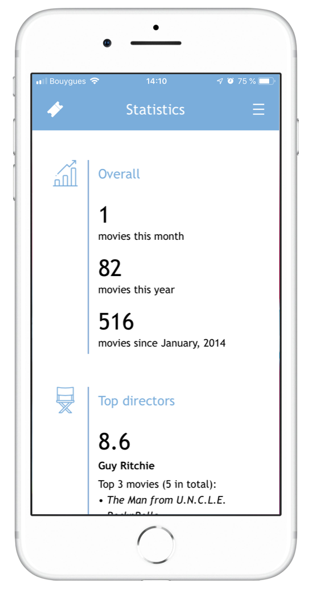

# Movie Journal

_Since January 2014, I have been keeping an Excel log of movies as I watched them, in order to keep track of what I watch and to compute some basic statistics. I recently decided to upgrade it._

This project aims at keeping a journal of the movies I have seen. It takes the form of a Postgres database containing both the logs of all the movies I have seen and [open IMDb data](https://www.imdb.com/interfaces/). This enables me to get a lot of information about the movies I have seen, and also to be able to compute all kinds of useful statistics (proportion of movies watched per genre, favourite directors, actors, writers, etc.)

In order to rate movies and add them to my database (with their IMDb ID!) conveniently, whenever I want from my phone or my computer, I also built a web app, in the form of a Flask Website, which looks something like this:

It recently evolved into a more sophisticated web app offering new features, such as a "Recent" page to check the most recent movies seen, a "Watchlist" page to store your movie watch list, and a "Statistics" page.

### 1. ETL

The ETL part of the project aims at inserting the open IMDb data into the database. To do so, one can use the script `main_etl.py`.

Usage example: `python main_etl.py -t titles`

The process is automated on my Raspberry Pi via a cron job, which purpose is to refresh the IMDb data on the database every week (to get updated rankings, new titles, etc.)

The `ETL` class (defined in `lib/etl.py`) is used and the process follows the three inherent steps of an ETL process:

- **Extract:** download the GZIP files from [open IMDb data](https://www.imdb.com/interfaces/), unzip them and split them into chunks. Chunking the file is necessary since the next two steps require the dataset to be loaded into memory (since I run this on my Raspberry Pi, which has little memory).

Then, for each chunk:

- **Transform:** load the chunk in memory and apply transformations, such as filtering, columns renaming, NA handling, etc.
- **Load:** load the resulting dataframe into the database. This process is performed by batch, each of which is loaded to the database using a bulk insert version of pandas `to_sql` function.

### 2. Flask App

Before creating this web-app, the Journal took the form of a database containing the open IMDb data, and the movies I watched identified by their IMDb ID. But this was not convenient:

- I did not have an easy access to the IMDb ID of the movies I wanted to add to the journal.
- Once I had the ID, I still could not add the movie from any device, or even from my phone, since it required to write an "insert" SQL query.
- I could not check easily which movies I had watched recently or compute basic statistics. It also required an SQL query.

This is why I built a Flask web-app, which enables me to do these things I cannot do easily, and more. 

The web-app code (routes, HTML templates, CSS code, etc.) can be found in the `app` folder. It is hosted on my Raspberry Pi so I can reach it at any time from my phone or computer.

This web-app is powered by [TMDb](https://www.themoviedb.org), which provides a free API to access its entire movie database (including IMDb IDs).

**Important Note:** 

**The Flask application must be run on a python 3.6+ environment**, since it uses the fact that basic python dicts are ordered. Using it with a lower Python version will result in search page malfunctions.

#### 2.1 Login page

This page is the landing page of the web app. As its existence suggests, the app supports multiple users, each of which will get its own history, statistics and watchlist.

Once logged in, the user is redirected to the Search page. The "Remember Me" option is automatically set to True for a period of 90 days.

At the bottom of the Login page, there is a "Sign up" link leading to a page where the user can sign up if not done yet. 

#### 2.2 Search page

The "Search" page enables the user to have a proper interface for searching and adding movies to my journal, from anywhere and without the need to write an SQL query.

Clicking on the top-left icon will always bring you back to an empty search page, while the top-right icon is the menu, it enables the user to acces the other pages.

#### 2.3 Recent page

The "Recent" page aims at enabling the user to have an easy access to the last movies that he or she watched.

The timeline was made using a combination of images, CSS styling and HTML table.

#### 2.4 Watchlist page

The watchlist page gathers the movies the user added to his or her watchlist, using the "Watchlist" button displayed on each search result.

Movies can be added to the journal directly from the watchlist, through the "Add" button. They can be removed from the watchlist with the "Unlist" button.

**Note:** adding a movie (from both the Search page and the Watchlist page) removes the movie from the watchlist, when applicable.

#### 2.5 Statistics page

The "Statistics" page aims at providing the user with some statistics regarding his or her activity and tastes.

Some statistics are really basic, such as the number of movies seen within the last month, or year. But some statistics are more interesting, such as the best directors, best actors, etc. For instance, if a user did not know a lot about directors, so he might have liked very much several movies of a specific director and not know him! This would show him within the list that you can see below:

